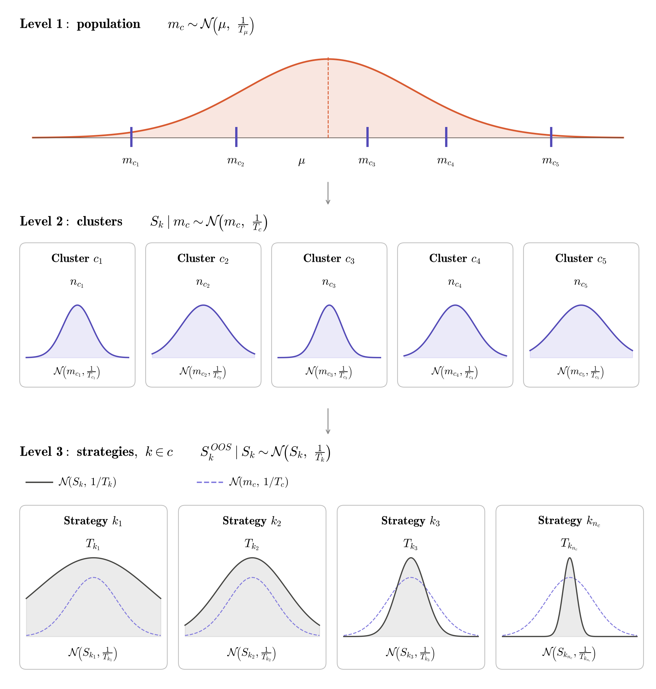

# Hierarchical shrinkage: population → cluster → strategy

## Model

Strategy $k$ belongs to cluster $c$ ($k \in c$).

$$
\begin{aligned}
m_c &\sim \mathcal N\!\left(\mu,\ \tfrac{1}{T_\mu}\right) && \text{population}\\[4pt]
S_k \mid m_c &\sim \mathcal N\!\left(m_c,\ \tfrac{1}{T_c}\right) && \text{cluster}\\[4pt]
S^{OOS}_k \mid S_k &\sim \mathcal N\!\left(S_k,\ \tfrac{1}{T_k}\right) && \text{strategy}
\end{aligned}
$$

## Cluster evidence and cluster average

$$
\bar T_c = \sum_{k\in c} \frac{T_k\,T_c}{T_k + T_c},
\qquad
\bar S^{OOS}_c = \frac{1}{\bar T_c}\sum_{k\in c} \frac{T_k\,T_c}{T_k + T_c}\,S^{OOS}_k
$$

## 1. Cluster mean, shrunk to population

$$
\hat m_c = \mu + \frac{\bar T_c}{\bar T_c + T_\mu}\left(\bar S^{OOS}_c - \mu\right),
\qquad
m_c \mid \text{data} \sim \mathcal N\!\left(\hat m_c,\ \frac{1}{\bar T_c + T_\mu}\right)
$$

## 2. Strategy, shrunk to its cluster

$$
\hat S_k = \hat m_c + \frac{T_k}{T_k + T_c}\left(S^{OOS}_k - \hat m_c\right),
\qquad
S_k \mid \text{data} \approx \mathcal N\!\left(\hat S_k,\ \frac{1}{T_k + T_c}\right)
$$
